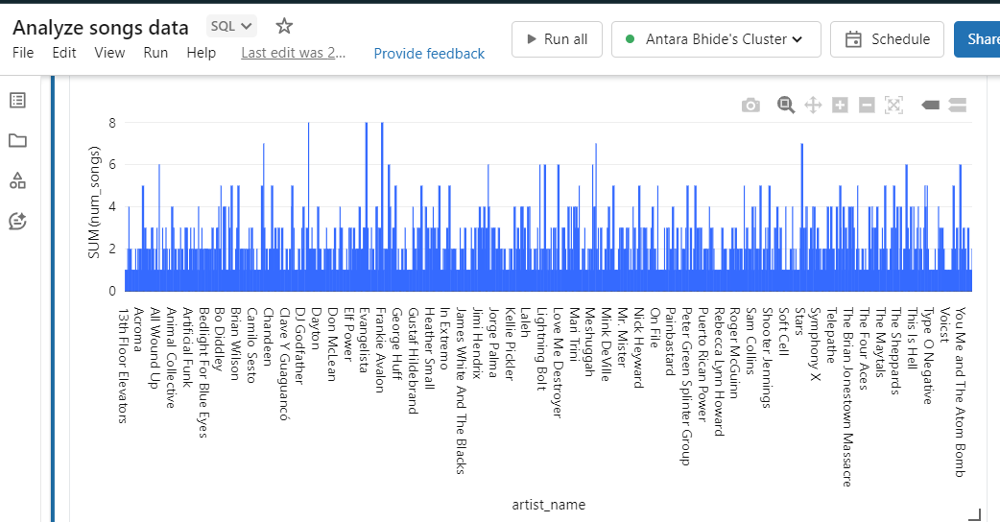
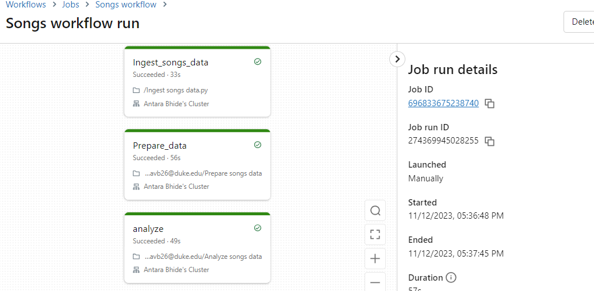

# INDIVIDUAL PROJECT 3

Azure Databricks is employed to construct a pipeline utilizing the lab's song dataset. I linked my Azure account to my GitHub repository, successfully pushing three files—Ingest, Prepare, Analyze—directly from Azure. Subsequently, I employed the Create Workflow feature in Azure to execute all three files within a data pipeline. Below, you can view screenshots of the Azure workflow in action.

# Walkthrough

## Capabilities of Delta Lake

### Time Travel

Delta Lake's time travel functionality facilitates querying the historical data, providing advantages for auditing, debugging, and error recovery. This pipeline utilizes time travel to track changes made to the dataset, allowing easy rollback to specific versions if needed.

### Metadata Management

Delta Lake maintains rich metadata, including schema information, data statistics, and lineage details. The pipeline leverages metadata management to gain insights into the dataset's structure and characteristics, aiding informed decision-making during data transformations.

### ACID Transactions

ACID transactions in Delta Lake ensure Atomicity, Consistency, Isolation, and Durability, ensuring data integrity and reliability. The pipeline relies on ACID transactions to guarantee that each operation on the dataset is atomic and that the data remains in a consistent state.

## Data Validation Checks

The notebook incorporates data validation checks using Delta Lake to enhance overall data quality. These checks identify incomplete rows and inconsistent schemas before the data analysis phase.

## Pipeline Overview

1. **Extract**: Utilizes the Python requests library to extract song data, saving it in the Databricks File System (DBFS).
   
2. **Transform**: Converts the CSV file into a Spark DataFrame

3. **Load**: Loads the Spark DataFrames into two Delta Lake tables, utilizing Delta Lake functionalities to verify data quality.

4. **Analyze**: Performs SQL queries

5. **Visualize**: Visualises the analyzed data

## Running the Pipeline

### Preparation

- Create a Databricks workspace.
- Create a cluster supporting PySpark (recommended minimum of 8 cores).
- Clone this GitHub repository into the workspace.

### Create a Job on Databricks Workflows with the Following Tasks:

- **Extract**: `databricks-tasks/extract.py`
- **Transform and Load**: `databricks-tasks/transform-load.py`
- **Query and Analyze**: `databricks-tasks/query_and_analyze.py`

### Trigger the Pipeline

The pipeline is set to automatically trigger on a push to the main branch of the GitHub repository, facilitated by the Databricks API and the `main.py` script. Additionally, there is a scheduled run set for 1 pm every Tuesday.

# PREPARE

# QUERY

# Successful data pipeline for all three: 

https://youtu.be/Hf_jIP6XPk4

