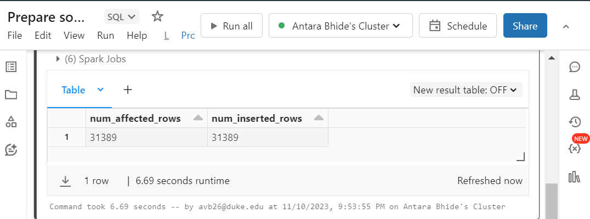
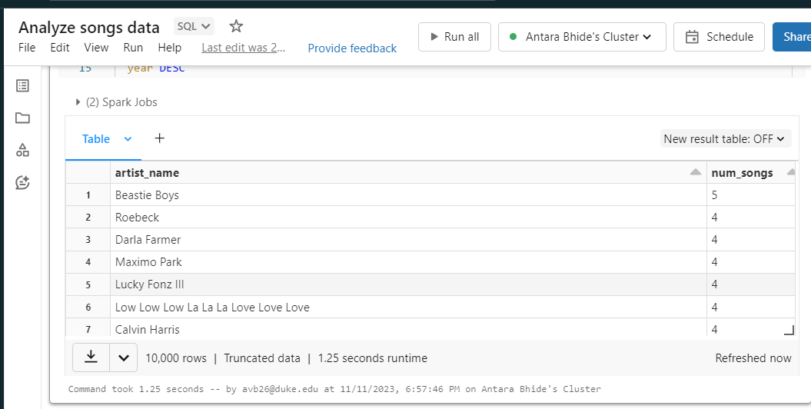
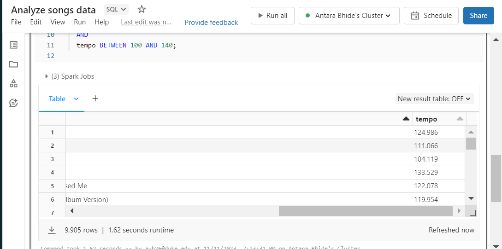

For this week's mini-project, Azure Databricks is employed to construct a pipeline utilizing the lab's song dataset. I linked my Azure account to my GitHub repository, successfully pushing three files—Ingest, Prepare, Analyze—directly from Azure. Subsequently, I employed the Create Workflow feature in Azure to execute all three files within a data pipeline. Below, you can view screenshots of the Azure workflow in action.

# PREPARE

# ANALYZE

# Successful data pipeline for all three: 

